# 机器学习算法（一）：基于逻辑回归的分类预测

## 一、逻辑回归原理

Logistic回归虽然名字里带“回归”，但是它实际上是一种分类方法，主要用于两分类问题（即输出只有两种，分别代表两个类别），所以利用了Logistic函数（或称为Sigmoid函数），函数形式为：

$$h(z)=\frac{1}{1+e^{-z}}$$

对应的函数图像可以表示为：

```python
import numpy as np
import matplotlib.pyplot as plt
x = np.arange(-5,5,0.01)
y = 1/(1+np.exp(-x))

plt.plot(x,y)
plt.xlabel('z')
plt.ylabel('y')
plt.grid()
plt.show()
```

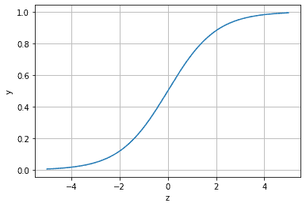

将回归方程写入其中：

$p=p(y=0|x,\theta)=h_\theta (x,\theta)=\frac {1}{1+e^{-(w_0+\sum_{i=1} ^N w_i x_i)}}$

所以，$p(y=1|x,\theta)=1-h_\theta(x,\theta)$。

## 二、Demo实践

```python
##  基础函数库
import numpy as np 

## 导入画图库
import matplotlib.pyplot as plt
import seaborn as sns

## 导入逻辑回归模型函数
from sklearn.linear_model import LogisticRegression

##Demo演示LogisticRegression分类

## 构造数据集
x_fearures = np.array([[-1, -2], [-2, -1], [-3, -2], [1, 3], [2, 1], [3, 2]])
y_label = np.array([0, 0, 0, 1, 1, 1])

## 调用逻辑回归模型
lr_clf = LogisticRegression()

## 用逻辑回归模型拟合构造的数据集
lr_clf = lr_clf.fit(x_fearures, y_label) #其拟合方程为 y=w0+w1*x1+w2*x2

##查看其对应模型的w
print('the weight of Logistic Regression:',lr_clf.coef_)
##查看其对应模型的w0
print('the intercept(w0) of Logistic Regression:',lr_clf.intercept_)
```
```
the weight of Logistic Regression:[[0.73462087 0.6947908]]
the intercept(w0) of Logistic Regression:[-0.03643213]
```

```python
## 可视化构造的数据样本点
plt.figure()
plt.scatter(x_fearures[:,0],x_fearures[:,1], c=y_label, s=50, cmap='viridis')
plt.title('Dataset')
plt.show()
```

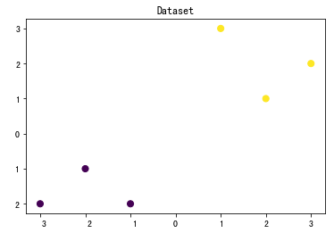

```python
# 可视化决策边界
plt.figure()
plt.scatter(x_fearures[:,0],x_fearures[:,1], c=y_label, s=50, cmap='viridis')
plt.title('Dataset')

nx, ny = 200, 100
x_min, x_max = plt.xlim()
y_min, y_max = plt.ylim()
x_grid, y_grid = np.meshgrid(np.linspace(x_min, x_max, nx),np.linspace(y_min, y_max, ny))

z_proba = lr_clf.predict_proba(np.c_[x_grid.ravel(), y_grid.ravel()])
z_proba = z_proba[:, 1].reshape(x_grid.shape)
plt.contour(x_grid, y_grid, z_proba, [0.5], linewidths=2.0, colors='blue')

plt.show()
```

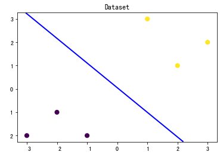

```python
### 可视化预测新样本

plt.figure()
## new point 1
x_fearures_new1 = np.array([[0, -1]])
plt.scatter(x_fearures_new1[:,0],x_fearures_new1[:,1], s=50, cmap='viridis')
plt.annotate(s='New point 1',xy=(0,-1),xytext=(-2,0),color='blue',arrowprops=dict(arrowstyle='-|>',connectionstyle='arc3',color='red'))

## new point 2
x_fearures_new2 = np.array([[1, 2]])
plt.scatter(x_fearures_new2[:,0],x_fearures_new2[:,1], s=50, cmap='viridis')
plt.annotate(s='New point 2',xy=(1,2),xytext=(-1.5,2.5),color='red',arrowprops=dict(arrowstyle='-|>',connectionstyle='arc3',color='red'))

## 导入训练数据点
plt.scatter(x_fearures[:,0],x_fearures[:,1], c=y_label, s=50, cmap='viridis')
plt.title('Dataset')

# 可视化决策边界
plt.contour(x_grid, y_grid, z_proba, [0.5], linewidths=2., colors='blue')

plt.show()
```

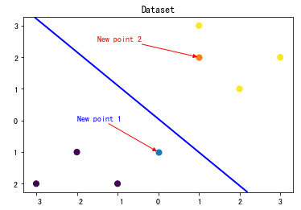

```python
##在训练集和测试集上分布利用训练好的模型进行预测
y_label_new1_predict=lr_clf.predict(x_fearures_new1)
y_label_new2_predict=lr_clf.predict(x_fearures_new2)
print('The New point 1 predict class:\n',y_label_new1_predict)
print('The New point 2 predict class:\n',y_label_new2_predict)
##由于逻辑回归模型是概率预测模型（前文介绍的p = p(y=1|x,\theta)）,所有我们可以利用predict_proba函数预测其概率
y_label_new1_predict_proba=lr_clf.predict_proba(x_fearures_new1)
y_label_new2_predict_proba=lr_clf.predict_proba(x_fearures_new2)
print('The New point 1 predict Probability of each class:\n',y_label_new1_predict_proba)
print('The New point 2 predict Probability of each class:\n',y_label_new2_predict_proba)
```

```
The New point 1 predict class:
 [0]
The New point 2 predict class:
 [1]
The New point 1 predict Probability of each class:
 [[ 0.67507358  0.32492642]]
The New point 2 predict Probability of each class:
 [[ 0.11029117  0.88970883]]
```

## 三、鸢尾花数据集的逻辑回归分类实践

***鸢尾花数据集简介：***

- 特征变量：4个，花萼长度、花萼宽度、花瓣长度、花瓣宽度
- 目标变量：3个，山鸢尾 (Iris-setosa)，变色鸢尾(Iris-versicolor)和维吉尼亚鸢尾(Iris-virginica)

```python
##  基础函数库
import numpy as np 
import pandas as pd

## 绘图函数库
import matplotlib.pyplot as plt
import seaborn as sns
```

```python
##我们利用sklearn中自带的iris数据作为数据载入，并利用Pandas转化为DataFrame格式
from sklearn.datasets import load_iris
data = load_iris() #得到数据特征
iris_target = data.target #得到数据对应的标签
iris_features = pd.DataFrame(data=data.data, columns=data.feature_names) #利用Pandas转化为DataFrame格式
```

```python
##利用.info()查看数据的整体信息
iris_features.info()
```

```
<class 'pandas.core.frame.DataFrame'>
RangeIndex: 150 entries, 0 to 149
Data columns (total 4 columns):
sepal length (cm)    150 non-null float64
sepal width (cm)     150 non-null float64
petal length (cm)    150 non-null float64
petal width (cm)     150 non-null float64
dtypes: float64(4)
memory usage: 4.8 KB
```


```python
##进行简单的数据查看，我们可以利用.head()头部.tail()尾部
iris_features.head()
```

|      | sepal length (cm) | sepal width (cm) | petal length (cm) | petal width (cm) |
| ---- | ----------------- | ---------------- | ----------------- | ---------------- |
| 0    | 5.1               | 3.5              | 1.4               | 0.2              |
| 1    | 4.9               | 3.0              | 1.4               | 0.2              |
| 2    | 4.7               | 3.2              | 1.5               | 0.2              |
| 3    | 4.6               | 3.1              | 1.5               | 0.2              |
| 4    | 5.0               | 3.6              | 1.4               | 0.2              |

```python
iris_features.tail()
```

|      | sepal length (cm) | sepal width (cm) | petal length (cm) | petal width (cm) |
| ---- | ----------------- | ---------------- | ----------------- | ---------------- |
| 145  | 6.7               | 3.0              | 5.2               | 2.3              |
| 146  | 6.3               | 2.5              | 5.0               | 1.9              |
| 147  | 6.5               | 3.0              | 5.2               | 2.0              |
| 148  | 6.2               | 3.4              | 5.4               | 2.3              |
| 149  | 5.9               | 3.0              | 5.1               | 1.8              |

```python
iris_target
```

```
array([0, 0, 0, 0, 0, 0, 0, 0, 0, 0, 0, 0, 0, 0, 0, 0, 0, 0, 0, 0, 0, 0, 0,
       0, 0, 0, 0, 0, 0, 0, 0, 0, 0, 0, 0, 0, 0, 0, 0, 0, 0, 0, 0, 0, 0, 0,
       0, 0, 0, 0, 1, 1, 1, 1, 1, 1, 1, 1, 1, 1, 1, 1, 1, 1, 1, 1, 1, 1, 1,
       1, 1, 1, 1, 1, 1, 1, 1, 1, 1, 1, 1, 1, 1, 1, 1, 1, 1, 1, 1, 1, 1, 1,
       1, 1, 1, 1, 1, 1, 1, 1, 2, 2, 2, 2, 2, 2, 2, 2, 2, 2, 2, 2, 2, 2, 2,
       2, 2, 2, 2, 2, 2, 2, 2, 2, 2, 2, 2, 2, 2, 2, 2, 2, 2, 2, 2, 2, 2, 2,
       2, 2, 2, 2, 2, 2, 2, 2, 2, 2, 2, 2])
```

```python
##利用value_counts函数查看每个类别数量

pd.Series(iris_target).value_counts()
```

```
2    50
1    50
0    50
dtype: int64
```

```python
##对于特征进行一些统计描述
iris_features.describe()
```

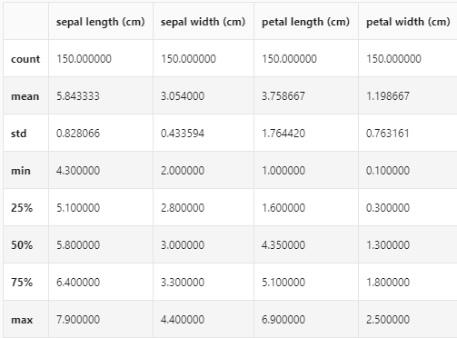

```python
## 合并标签和特征信息
iris_all = iris_features.copy() ##进行浅拷贝，防止对于原始数据的修改
iris_all['target'] = iris_target
```

```python
## 特征与标签组合的散点可视化
sns.pairplot(data=iris_all,diag_kind='hist', hue= 'target')
plt.show()
```

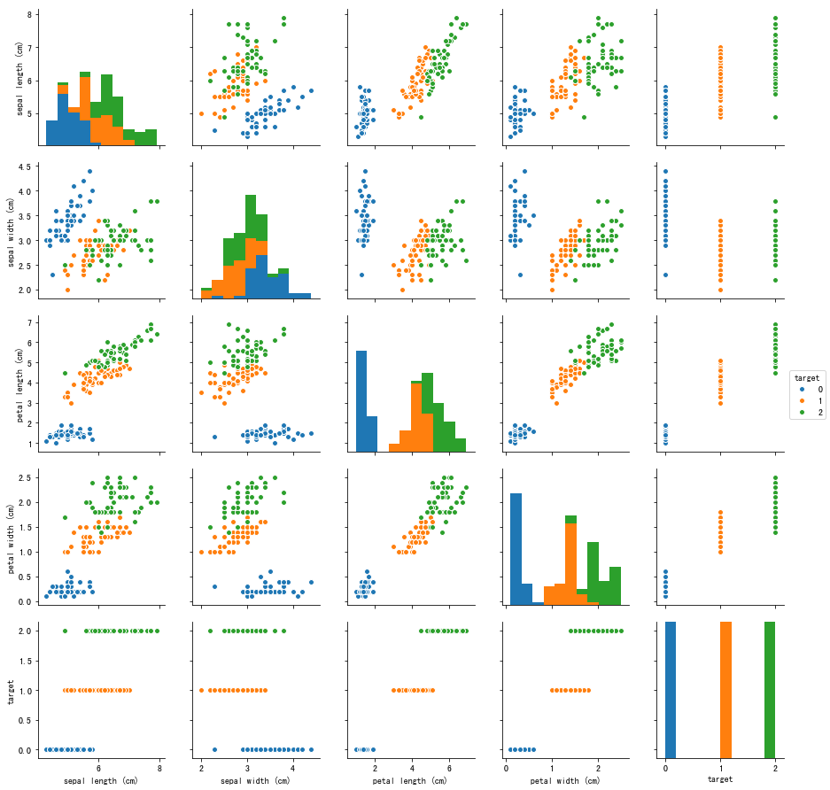

```python
for col in iris_features.columns:
    sns.boxplot(x='target', y=col, saturation=0.5, 
palette='pastel', data=iris_all)
    plt.title(col)
    plt.show()
```

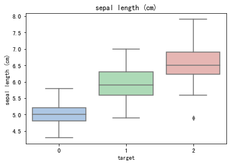

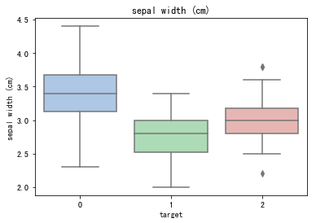

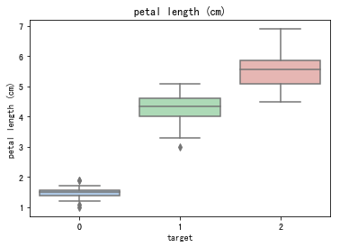

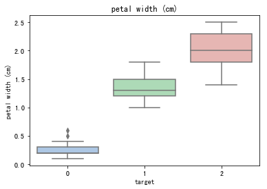

```python
# 选取其前三个特征绘制三维散点图
from mpl_toolkits.mplot3d import Axes3D

fig = plt.figure(figsize=(10,8))
ax = fig.add_subplot(111, projection='3d')

iris_all_class0 = iris_all[iris_all['target']==0].values
iris_all_class1 = iris_all[iris_all['target']==1].values
iris_all_class2 = iris_all[iris_all['target']==2].values
# 'setosa'(0), 'versicolor'(1), 'virginica'(2)
ax.scatter(iris_all_class0[:,0], iris_all_class0[:,1], iris_all_class0[:,2],label='setosa')
ax.scatter(iris_all_class1[:,0], iris_all_class1[:,1], iris_all_class1[:,2],label='versicolor')
ax.scatter(iris_all_class2[:,0], iris_all_class2[:,1], iris_all_class2[:,2],label='virginica')
plt.legend()

plt.show()
```

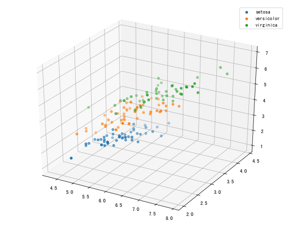

```python
##为了正确评估模型性能，将数据划分为训练集和测试集，并在训练集上训练模型，在测试集上验证模型性能。
from sklearn.model_selection import train_test_split
##选择其类别为0和1的样本（不包括类别为2的样本）
iris_features_part=iris_features.iloc[:100]
iris_target_part=iris_target[:100]
##测试集大小为20%，80%/20%分
x_train,x_test,y_train,y_test=train_test_split(iris_features_part,iris_target_part,test_size=0.2,random_state=2020)

##从sklearn中导入逻辑回归模型
from sklearn.linear_model import LogisticRegression
##定义逻辑回归模型
clf=LogisticRegression(random_state=0,solver='lbfgs')

##在训练集上训练逻辑回归模型
clf.fit(x_train,y_train)

##查看其对应的w
print('the weight of Logistic Regression:',clf.coef_)

##查看其对应的w0
print('the intercept(w0) of Logistic Regression:',clf.intercept_)


##在训练集和测试集上分布利用训练好的模型进行预测
train_predict=clf.predict(x_train)
test_predict=clf.predict(x_test)

from sklearn import metrics
##利用accuracy（准确度）【预测正确的样本数目占总预测样本数目的比例】评估模型效果
print('The accuracy of the Logistic Regression is:',metrics.accuracy_score(y_train,train_predict))
print('The accuracy of the Logistic Regression is:',metrics.accuracy_score(y_test,test_predict))

##查看混淆矩阵(预测值和真实值的各类情况统计矩阵)
confusion_matrix_result=metrics.confusion_matrix(test_predict,y_test)
print('The confusion matrix result:\n',confusion_matrix_result)

##利用热力图对于结果进行可视化
plt.figure(figsize=(8,6))
sns.heatmap(confusion_matrix_result,annot=True,cmap='Blues')
plt.xlabel('Predictedlabels')
plt.ylabel('Truelabels')
plt.show()
```

```
the weight of Logistic Regression: [[ 0.45244919 -0.81010583  2.14700385  0.90450733]]
the intercept(w0) of Logistic Regression: [-6.57504448]
The accuracy of the Logistic Regression is: 1.0
The accuracy of the Logistic Regression is: 1.0
The confusion matrix result:
 [[ 9  0]
 [ 0 11]]
```

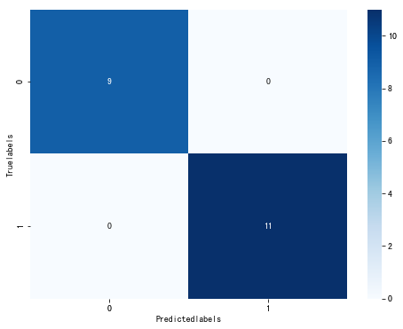

```python
##测试集大小为20%，80%/20%分
x_train,x_test,y_train,y_test=train_test_split(iris_features,iris_target,test_size=0.2,random_state=2020)

##定义逻辑回归模型
clf=LogisticRegression(random_state=0,solver='lbfgs')

##在训练集上训练逻辑回归模型
clf.fit(x_train,y_train)

##查看其对应的w
print('the weight of Logistic Regression:\n',clf.coef_)
##查看其对应的w0
print('the intercept(w0) of Logistic Regression:\n',clf.intercept_)
##由于这个是3分类，所有我们这里得到了三个逻辑回归模型的参数，其三个逻辑回归组合起来即可实现三分类
```

```
the weight of Logistic Regression:
 [[-0.43538857  0.87888013 -2.19176678 -0.94642091]
 [-0.39434234 -2.6460985   0.76204684 -1.35386989]
 [-0.00806312  0.11304846  2.52974343  2.3509289 ]]
the intercept(w0) of Logistic Regression:
 [  6.30620875   8.25761672 -16.63629247]
```

```python
##在训练集和测试集上分布利用训练好的模型进行预测
train_predict=clf.predict(x_train)
test_predict=clf.predict(x_test)
##由于逻辑回归模型是概率预测模型（前文介绍的p=p(y=1|x,\theta)）,所有我们可以利用predict_proba函数预测其概率

train_predict_proba=clf.predict_proba(x_train)
test_predict_proba=clf.predict_proba(x_test)

print('The test predict Probability of each class:\n',test_predict_proba)
##其中第一列代表预测为0类的概率，第二列代表预测为1类的概率，第三列代表预测为2类的概率。

##利用accuracy（准确度）【预测正确的样本数目占总预测样本数目的比例】评估模型效果
print('The accuracy of the Logistic Regression is:',metrics.accuracy_score(y_train,train_predict))
print('The accuracy of the Logistic Regression is:',metrics.accuracy_score(y_test,test_predict))
```

```
The test predict Probability of each class:
 [[  1.32525870e-04   2.41745142e-01   7.58122332e-01]
 [  7.02970475e-01   2.97026349e-01   3.17667822e-06]
 [  3.37367886e-02   7.25313901e-01   2.40949311e-01]
 [  5.66207138e-03   6.53245545e-01   3.41092383e-01]
 [  1.06817066e-02   6.72928600e-01   3.16389693e-01]
 [  8.98402870e-04   6.64470713e-01   3.34630884e-01]
 [  4.06382037e-04   3.86192249e-01   6.13401369e-01]
 [  1.26979439e-01   8.69440588e-01   3.57997319e-03]
 [  8.75544317e-01   1.24437252e-01   1.84312617e-05]
 [  9.11209514e-01   8.87814689e-02   9.01671605e-06]
 [  3.86067682e-04   3.06912689e-01   6.92701243e-01]
 [  6.23261939e-03   7.19220636e-01   2.74546745e-01]
 [  8.90760124e-01   1.09235653e-01   4.22292409e-06]
 [  2.32339490e-03   4.47236837e-01   5.50439768e-01]
 [  8.59945211e-04   4.22804376e-01   5.76335679e-01]
 [  9.24814068e-01   7.51814638e-02   4.46852786e-06]
 [  2.01307999e-02   9.35166320e-01   4.47028801e-02]
 [  1.71215635e-02   5.07246971e-01   4.75631465e-01]
 [  1.83964097e-04   3.17849048e-01   6.81966988e-01]
 [  5.69461042e-01   4.30536566e-01   2.39269631e-06]
 [  8.26025475e-01   1.73971556e-01   2.96936737e-06]
 [  3.05327704e-04   5.15880492e-01   4.83814180e-01]
 [  4.69978972e-03   2.90561777e-01   7.04738434e-01]
 [  8.61077168e-01   1.38915993e-01   6.83858427e-06]
 [  6.99887637e-04   2.48614010e-01   7.50686102e-01]
 [  5.33421842e-02   8.31557126e-01   1.15100690e-01]
 [  2.34973018e-02   3.54915328e-01   6.21587370e-01]
 [  1.63311193e-03   3.48301765e-01   6.50065123e-01]
 [  7.72156866e-01   2.27838662e-01   4.47157219e-06]
 [  9.30816593e-01   6.91640361e-02   1.93708074e-05]]
The accuracy of the Logistic Regression is: 0.958333333333
The accuracy of the Logistic Regression is: 0.8
```

```python
##查看混淆矩阵
confusion_matrix_result=metrics.confusion_matrix(test_predict,y_test)
print('The confusion matrix result:\n',confusion_matrix_result)

##利用热力图对于结果进行可视化
plt.figure(figsize=(8,6))
sns.heatmap(confusion_matrix_result,annot=True,cmap='Blues')
plt.xlabel('Predicted labels')
plt.ylabel('True labels')
plt.show()
```

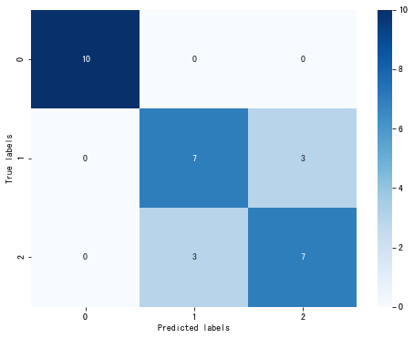

### 补充学习内容

#### 批量梯度下降算法（BGD）

所谓批量梯度下降法就是吴恩达教授机器学习中提到的同时更新 $\theta_j:=\theta_j-\alpha\frac{\partial}{\partial \theta_j}J(\theta)$。

学习率统一为$\alpha$。

#### 随机梯度下降算法（SGD）

**随机选取一个点做梯度下降**，而不是遍历所有样本后进行参数迭代。因为梯度下降法的代价函数计算需要遍历所有样本，而且是每次迭代都要遍历，直至达到局部最优解，在样本量庞大时就显得收敛速度比较慢了，计算量非常庞大。

随机梯度下降仅以当前样本点进行最小值求解，通常无法达到真正局部最优解，但可以比较接近。属于大样本兼顾计算成本的折中方案。

#### 随机并行梯度下降算法（SPGD)

选取目标函数的负梯度方向(最速下降方向)作为每步迭代的搜索方向，沿此方向前进一个步长，如此循环下去，便可以逐步逼近函数的极值点。它的梯度估值是通过**对目标函数$J(\theta)$的控制参量$\alpha$施加随机扰动**来实现的。

#### 正则化

- **L1正则化**是指权值向量W中各个元素的绝对值之和。

- **L2正则化**是指权值向量W中各个元素的平方和然后再求平方根

#### 三种方法实现逻辑回归多分类

##### One-Vs-All

One-Vs-All（或者叫 One-Vs-Rest）的思想是把一个多分类的问题变成多个二分类的问题。转变的思路就如同方法名称描述的那样，选择其中一个类别为正类（Positive），使其他所有类别为负类（Negative）。

- 优点：普适性还比较广，可以应用于能输出值或者概率的分类器，同时效率相对较好，有多少个类别就训练多少个分类器。

- 缺点：很容易造成训练集样本数量的不平衡（Unbalance），尤其在类别较多的情况下，经常容易出现正类样本的数量远远不及负类样本的数量，这样就会造成分类器的偏向性。

##### One-Vs-One

相比于 One-Vs-All 由于样本数量可能的偏向性带来的不稳定性，One-Vs-One 是一种相对稳健的扩展方法。对于同样的三分类问题，我们像举行车轮作战一样让不同类别的数据两两组合训练分类器，可以得到 3 个二元分类器。

One-Vs-One 的优点也很明显，它在一定程度上规避了数据集 unbalance 的情况，性能相对稳定，并且需要训练的模型数虽然增多，但是每次训练时训练集的数量都降低很多，其训练效率会提高。

##### Softmax

在二元的逻辑回归模型中，我们用 Sigmoid 函数将一个多维数据（一个样本）映射到一个 0 - 1 之间的数值上，有没有什么方法从数学上让一个样本映射到多个 0 - 1 之间的数值呢？答案是通过 Softmax 函数。

$h_{\theta}\left(x^{(i)}\right)=\left[\begin{array}{c}p\left(y^{(i)}=1 \mid x^{(i)} ; \theta\right) \\ p\left(y^{(i)}=2 \mid x^{(i)} ; \theta\right) \\ \vdots \\ p\left(y^{(i)}=k \mid x^{(i)} ; \theta\right)\end{array}\right]=\frac{1}{\sum_{j=1}^{k} e^{\theta_{j}^{T} x^{(i)}}}\left[\begin{array}{c}e^{\theta_{1}^{I} x^{(3)}} \\ e^{\theta_{2}^{T} x^{(i)}} \\ \vdots \\ e^{\theta_{k}^{T} x^{(i)}}\end{array}\right]$

$\frac{1}{\sum_{j=1}^{k} e^{\theta_{j}^{T} x^{(i)}}}$ 使所有概率之和为 1，是对概率分布进行归一化。


为什么选用指数函数呢？有一些简单的理由 ：

1. 指数函数简单，并且是非线性的
2. 该函数严格递增
3. 这是一个凸函数

定义了新的假设函数（hypothesis function）之后，我们要得到其对应的代价函数（cost function）。

$J(\theta)=-\frac{1}{m}\left[\sum_{i=1}^{m} \sum_{j=1}^{k} 1\left\{y^{(i)}=j\right\} \log \frac{e^{\theta_{j}^{T} x^{(i)}}}{\sum_{l=1}^{k} e^{\theta_{l}^{T} x^{(i)}}}\right]$

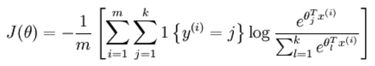

其中 1{·} 的取值规则为大括号内的表达式值为真时，取 1，为假时取 0。

对该代价函数求最优解同样可以使用如梯度下降之类的迭代算法，其梯度公式如下：

$\nabla_{\theta_{j}} J(\theta)=-\frac{1}{m} \sum_{i=1}^{m}\left[x^{(i)}\left(1\left\{y^{(i)}=j\right\}-p\left(y^{(i)}=j \mid x^{(i)} ; \theta\right)\right)\right]$

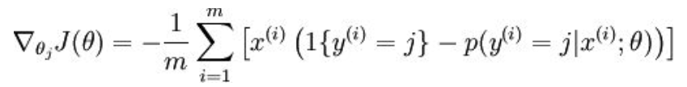

有了偏导数，就可以对代价函数进行优化，最终求解。

本质上讲，Softmax 回归就是 logistic 回归进行多分类时的一种数学拓展，如果让分类数为 2 带入 softmax 回归，会发现其本质上和 logistic 回归是一样的。

在处理一些样本可能丛属多个类别的分类问题是，使用 one vs one 或 one vs all 有可能达到更好的效果。

Softmax 回归适合处理一个样本尽可能属于一种类别的多分类问题。